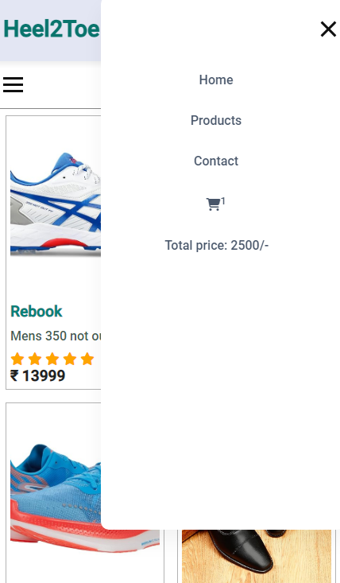

# <h1 align="center">Heel2Toe (shoe store)</h1>
___

>[!NOTE]
> All **Data** regarding Products has been **filled manually** through admin panel to the Database, so you will find less & experimental Data.

- __Tech Used:__ Built with PHP, MySQL, HTML, CSS, and JS to ensure an intuitive shopping experience.

- **E-commerce Capabilities**: Enabled user to browse products, add items to the cart, and fill out the checkout details.

- **User-Friendly Interface:** Simple and Responsive application for diffrent screen size.

- __Search and Filter:__ Contain search and filter functionalities to get data based on categories and brands.

---
### Let's visit to Our Application
[Heel2Toe Live Link](https://heel2toe.42web.io)
---

### Home Page (preview)

### Prdouct Page (small screen)

### Product Page (large screen)

### Visit for more. Thanks for visiting 😍🤗
[Heel2Toe Live Link](https://heel2toe.42web.io)
